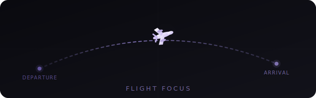
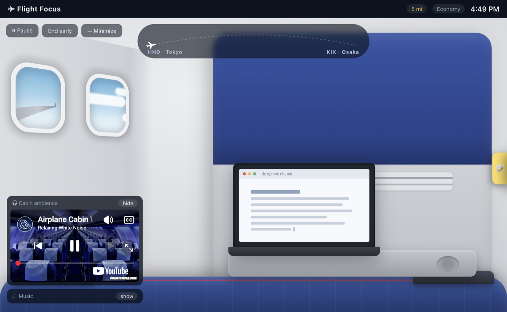
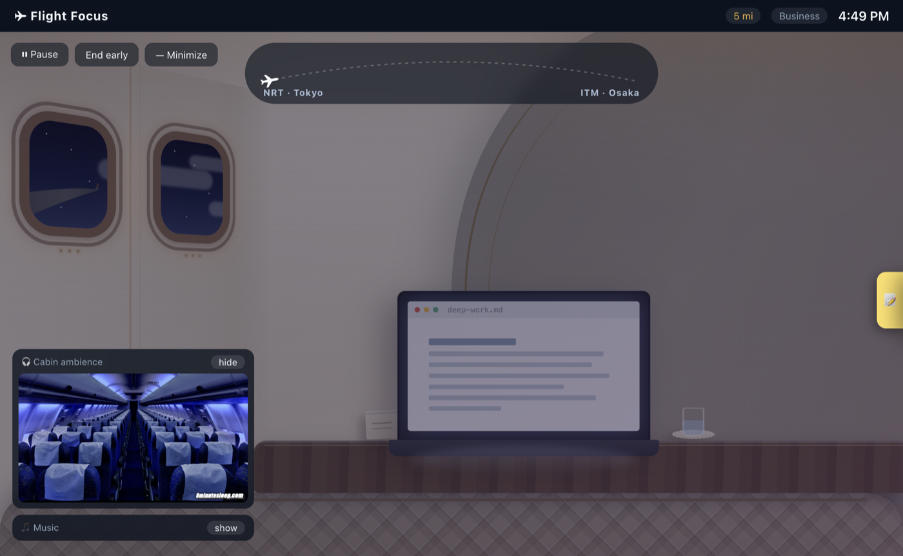
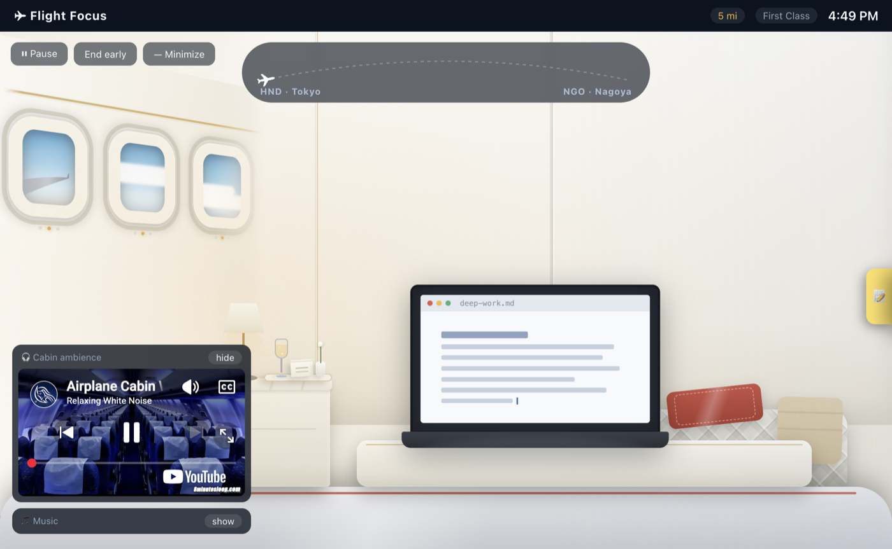

  

<h1 align="center">Flight Mode ✈</h1>

  <strong>your focus session, boarded as a real flight</strong>

  
  
  
  

  <a href="#what-it-is">What</a> •
  <a href="#seat-classes">Seat Classes</a> •
  <a href="#download">Download</a> •
  <a href="#run-from-source">Run From Source</a> •
  <a href="#how-miles-work">Miles</a>

---

## What It Is

Flight Mode turns a focus session into an airplane flight. Tell it how long you want to work and where you're departing from, and it matches a **real flight route** of similar duration from a bundled dataset of 21,310 routes — then prints your boarding pass and seats you at a window.

**There is no countdown timer.** The only progress indicator is a small plane crossing the route line, plus the wall clock. The flight keeps flying when you switch apps (no penalty). About five minutes before landing, a gentle cabin chime and an OS notification tell you to prepare for descent.

Completing flights earns miles. Miles buy cosmetic seat upgrades — the timer is never gated. A sticky-note task list docks to the right edge, and an optional YouTube panel plays cabin ambience or your own lofi. **Everything except the music works fully offline.**

## Seat Classes

| Class | Cost | Cabin |
|---|---|---|
| **Economy** | free | Navy fabric seatback ahead, your laptop on its fold-down tray, two windows |
| **Business** | 500 mi | Cream leather pod: wood console, minibar, brass trim, gold mood light |
| **First** | 1,500 mi | White suite: three windows, marble-top cabinet, table lamp, champagne |

  
  
  

Cabin lighting follows **your local time** — bright by day, dimmed with stars, glowing lamps and a blinking wingtip light after dark.

## Download

Grab the latest installer from **[Releases](https://github.com/AnnaThomas2060/flight-mode/releases)**:

- **macOS (Apple Silicon):** `Flight Focus-x.x.x-arm64.dmg`
- **Windows (64-bit):** `Flight Focus Setup x.x.x.exe`

> **macOS:** the app isn't code-signed yet — the first time, right-click the app → **Open** → **Open**.
> **Windows:** if SmartScreen appears, click **More info** → **Run anyway**.

## Run From Source

**Requirements:** Node.js 20+

1. `git clone https://github.com/AnnaThomas2060/flight-mode.git && cd flight-mode`
2. `npm install`
3. `npm start`
4. To build installers: `npm run dist` (output lands in `exec-app/`)
5. To regenerate the route dataset: see `tools/generate-routes.js`

## How Miles Work

| Rule | Value |
|---|---|
| Base earning | 1 mile per focused minute completed |
| Completion bonus | +20% of the session, if you land (no early exit) |
| Daily streak | +5 × streak length (capped at 10), first landing each day |
| Emergency landing | Base miles for finished legs only — no bonus |

Sessions longer than 4 hours split into multiple legs with layovers between them, each leg a real connecting flight out of the airport you just landed at.

---

Route data from [OpenFlights](https://github.com/jpatokal/openflights), © OpenFlights contributors, under the [Open Database License](https://opendatacommons.org/licenses/odbl/). Flight durations are estimated from great-circle distance. Cabin ambience plays via the official YouTube embed.
